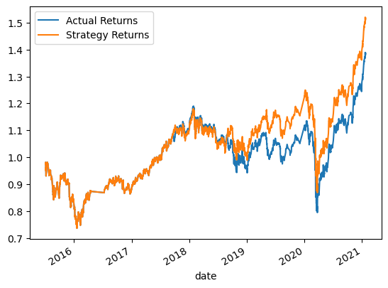
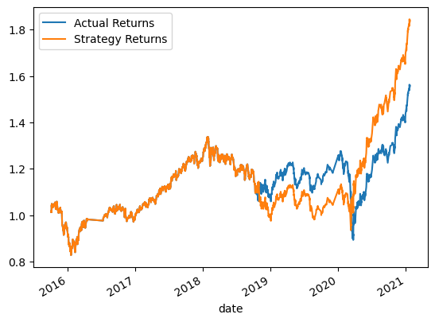
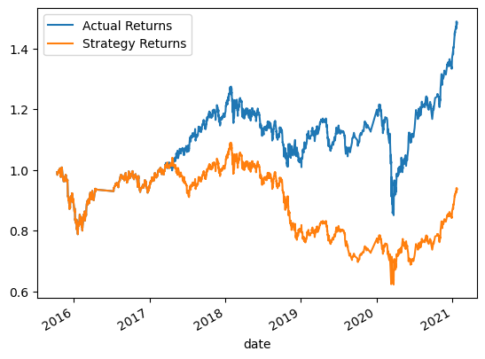
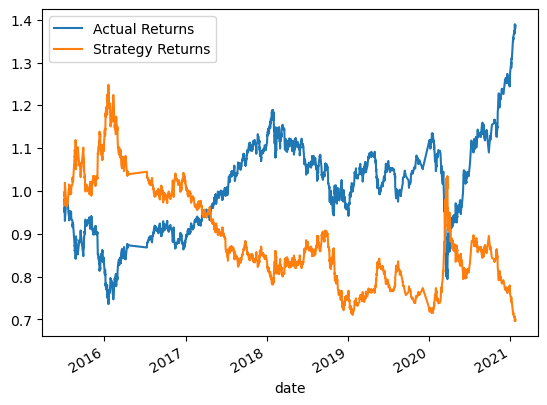
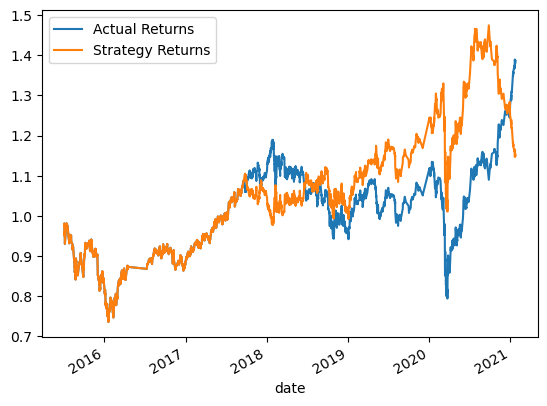

# Module 14 - Algorithmic Trading

This is the page for the fourteenth module of the Fintech Bootcamp course, covering Algorithmic Trading with Machine Learning.

This page is a continuation of my GitHub learning structure for this course.

Above you will see the *^*.ipynb file for this homework

## Algorithms and Classifiers

I reviewed the results of five algorithms in total.

Three algorithms using SVC with tuned training period and window sizes.

I then compared two different classifiers on the best performing SVC model.

## Results

* __*1 - Baseline Algorithm Performance Establishment*__
  * Classifier      : SVC 
  * Short Window    : 4  
  * Long Window     : 100 
  * Training Offset : 3 months  
 

  

 

* __*2 - Tuning Algorithm Performance Period*__
  * Classifier      : SVC 
  * Short Window    : 4  
  * Long Window     : 100 
  * Training Offset : 6 months  
 

  

 
 

* __*3 - Tuning Algorithm Performance Window*__
  * Classifier      : SVC 
  * Short Window    : 1  
  * Long Window     : 25 
  * Training Offset : 6 months  
 

  

 

* __*4 - Decision Tree Classifier Evaluation*__
  * Classifier      : Decision Tree 
  * Short Window    : 4  
  * Long Window     : 100 
  * Training Offset : 3 months  
 

  

 

* __*5 - Logistical Regression Classifier Evaluation*__
  * Classifier      : Logisitic Regression 
  * Short Window    : 4  
  * Long Window     : 100 
  * Training Offset : 3 months  
 

  

 

## Conclusions

In the limited testing pool above, the second SVC model tuning the training period alone returned the best results. Returns never dropped below 0.8 and mostly was above 1. It achieved the highest return in both number and over time.

The shorter windows didn't provide a better outcome in these examples. 

While I didn't add more images, I did quickly test the initial SVC model and the Tree and Logistic Regression algorithms on a 6 month training period which showed interesting results. 

The first SVC, interestingly, produced a slightly worse result. The Tree improved a lot, but still not great. The Logistic Regression model produced worse results.

One would assume that expanding the training set would improve the results. While this was supported with the best results achieved using SVC and a longer training set, this was not obviously not reflected with those quick tests I mentioned above.

Above all, this tells me there are a lot of factors that affect the performance and as such would require a fair amount of testing / trial and error to get the desired result. 

## Back to Fintech Home

* [Fintech Bootcamp Home](https://github.com/d4np3/fintech)
